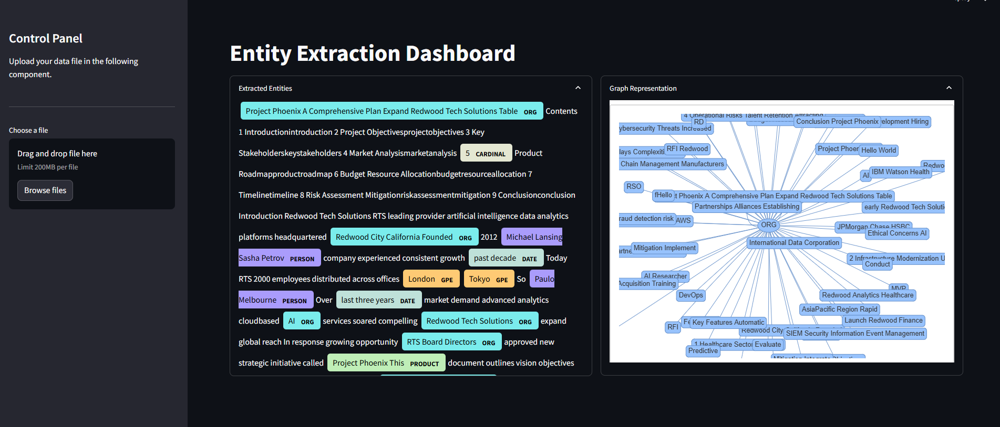

# Named Entity Extraction Demo Project

This repository contains an example of entity extraction using natural language processing (NLP) techniques. The goal is to identify and extract specific entities from a given text, such as names, dates, locations, and more.

## Installation

To install the necessary dependencies, run the following command:

```bash
pip install -r requirements.txt
```

## Source Files
Following Python source files are included in `/src` path.

- `engine.py`: contains NER processing logic used for backend API server and streamlit frontend application
- `app.py`: Flask backend server that accepts json payload
- `dashboard.py`: Streamlit frontend application. Visualizes extracted entities and their graphical represatation

## Backend Server Testing

To spin up the Flask backend server, user the following command.
```bash
python src/app.py
```
Flask backend server takes the input payload as the following example.
```python
url = "http://127.0.0.1:5000/endpoint"
payload = {
    "text": "Project Phoenix: A Comprehensive Plan to Expand Redwood Tech Solutions\n\n### Table of Contents\n1. [Introduction](#introduction)\n2. [Project Objectives](#project-objectives)\n3. [Key Stakeholders](#key-stakeholders)\n4. [Market Analysis](#market-analysis)\n5. [Product Roadmap](#product-roadmap)\n6. [Budget & Resource Allocation](#budget--resource-allocation)\n7"
}
headers = {"Content-Type": "application/json"}

response = requests.post(url, json=payload, headers=headers)
```

## Frontend NER engine execution
For quick testing, the current project is visualized via streamlit application. To run the frontend server, use the following command.

```bash
streamlit run src/dashboard.py
```



